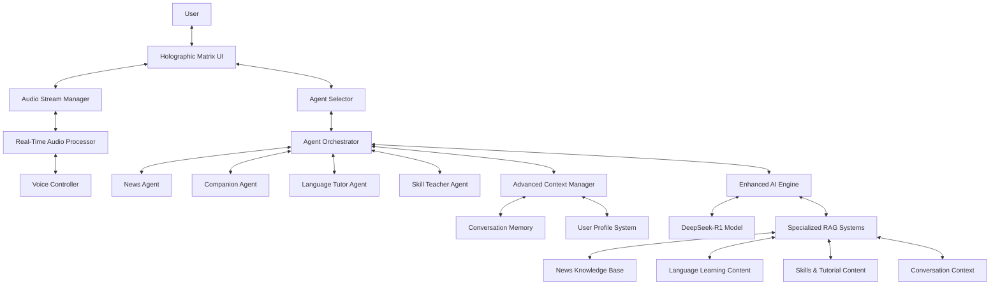

# Live AI Agent Enhancement - Design Document

## Overview

This design document outlines the architecture for enhancing the JARVIS Voice Assistant with specialized Live AI Agent capabilities. The enhancement transforms the existing system into a real-time, conversational AI platform similar to Gemini Live, featuring specialized agent personalities, continuous audio streaming, comprehensive language learning, and intelligent conversation management. The design builds upon the existing PyQt6-based architecture while introducing new real-time processing capabilities and agent specialization systems, all wrapped in a stunning sci-fi holographic matrix interface.

## Architecture

The Live AI Agent enhancement introduces several new architectural layers while maintaining compatibility with the existing JARVIS system:



## Components and Interfaces

### Sci-Fi Holographic Matrix UI Layer

#### Advanced Holographic Interface System
```python
class HolographicMatrixInterface(QWidget):
    """Sci-fi hologram matrix interface with advanced visual effects"""
    
    def __init__(self):
        self.matrix_core = MatrixCoreSystem()
        self.hologram_engine = VolumetricHologramEngine()
        self.neural_interface = NeuralInterfaceSystem()
        self.quantum_visualizer = QuantumStateVisualizer()
        self.dimensional_controls = MultidimensionalControlSystem()
        
    def setup_ui(self):
        # Layered holographic interfaces with depth perception
        # Digital matrix rain with Thai/English characters flowing through 3D space
        # Quantum particle systems that react to user proximity
        # Neural network visualization with pulsing energy connections
        # Hexagonal cell structure with animated data flows
        # Holographic projections that extend beyond screen boundaries
```

#### Matrix Code Rain System
```python
class MatrixCodeRainSystem(QWidget):
    """Advanced matrix code rain with interactive elements"""
    
    def __init__(self):
        self.code_streams = MultidimensionalCodeStreams()
        self.glyph_generator = DynamicGlyphGenerator()
        self.interaction_field = TouchReactiveField()
        self.data_visualization = DataFlowVisualizer()
        
    def setup_effects(self):
        # 3D matrix code rain with varying depths and speeds
        # Reactive code streams that part around user interaction
        # Glyphs that transform between Thai, English and symbolic representations
        # Data visualization embedded within the code rain
        # Color shifts based on system state and agent type
        
    def create_holographic_rain(self):
        # Generate volumetric code rain with parallax effect
        # Create depth-based focus effects with blur gradients
        # Implement reactive lighting with dynamic shadows
        # Add floating data fragments with physics simulation
```

#### Dimensional Hologram Projection System
```python
class DimensionalHologramSystem(QWidget):
    """Advanced holographic projection system with dimensional effects"""
    
    def __init__(self):
        self.projection_engine = VolumetricProjectionEngine()
        self.dimensional_rifts = DimensionalRiftGenerator()
        self.holographic_entities = HolographicEntitySystem()
        self.energy_field = QuantumEnergyFieldSimulator()
        self.spatial_audio = SpatialAudioVisualizer()
        
    def create_agent_projection(self, agent_type: str):
        # Generate unique holographic avatar for each agent type
        # Create dimensional portal effect during agent transitions
        # Project volumetric energy signatures unique to each agent
        # Simulate quantum particle effects around holographic entities
        # Implement reactive lighting and shadow systems
        
    def project_information_space(self, data_type: str, content: dict):
        # Create multi-layered information spaces with depth
        # Generate floating data panels with holographic projections
        # Implement interactive data manipulation through gestures
        # Create dimensional transitions between information spaces
        # Project neural connection visualizations between related data
```

#### Neural Interface Visualization
```python
class NeuralInterfaceVisualizer(QWidget):
    """Advanced neural network visualization for AI processing"""
    
    def __init__(self):
        self.neural_network = DynamicNeuralNetworkVisualizer()
        self.thought_process = ThoughtProcessVisualizer()
        self.energy_flows = EnergyFlowSimulator()
        self.decision_trees = DecisionTreeProjector()
        
    def visualize_ai_processing(self, complexity: float, process_type: str):
        # Generate dynamic neural network visualization with flowing energy
        # Create branching decision trees with probability indicators
        # Simulate thought processes with particle flows and connections
        # Project energy transfers between neural clusters
        # Visualize confidence levels with dimensional depth
        
    def show_reasoning_process(self, reasoning_steps: list):
        # Create step-by-step visualization of AI reasoning
        # Project holographic thought bubbles with key concepts
        # Generate connection pathways between related thoughts
        # Simulate neural activation patterns during reasoning
        # Create dimensional layers for hierarchical thinking
```

#### Quantum Audio Visualization System
```python
class QuantumAudioVisualizer(QWidget):
    """Quantum-inspired audio visualization with dimensional effects"""
    
    def __init__(self):
        self.waveform_projector = HolographicWaveformProjector()
        self.quantum_particles = QuantumParticleSystem()
        self.frequency_visualizer = FrequencyDimensionVisualizer()
        self.energy_field = SonicEnergyField()
        self.dimensional_bridges = InterdimensionalBridges()
        
    def setup_visualization(self):
        # Create floating 3D waveform with holographic projection
        # Generate quantum particle system that reacts to audio
        # Implement frequency visualization with dimensional depth
        # Project energy fields that pulse with audio intensity
        # Create dimensional bridges during voice transitions
        
    def update_audio_data(self, audio_data: np.ndarray):
        # Transform audio into quantum probability fields
        # Generate particle systems that react to voice frequencies
        # Create dimensional rifts during voice transitions
        # Project holographic sound waves with volumetric depth
        # Visualize AI processing as neural energy flows
        # Create matrix code patterns that flow with audio rhythm
```

#### Sci-Fi Control Systems
```python
class SciFiControlSystems(QWidget):
    """Advanced sci-fi control systems with holographic interfaces"""
    
    def __init__(self):
        self.hexagonal_controls = HexagonalControlArray()
        self.holographic_buttons = FloatingHologramButtons()
        self.gesture_system = DimensionalGestureSystem()
        self.energy_controls = EnergyFlowControls()
        
    def create_control_system(self):
        # Generate floating hexagonal control panels
        # Create holographic buttons with tactile feedback
        # Implement gesture recognition with visual trails
        # Project energy flow indicators for system status
        # Create dimensional transitions for menu navigation
        
    def setup_agent_controls(self):
        # Generate unique control interfaces for each agent
        # Create holographic agent selection carousel
        # Implement neural connection visualizations between controls
        # Project energy signatures for active systems
        # Create quantum particle effects for transitions
```

### Audio Stream Manager

#### Continuous Audio Pipeline
```python
class AudioStreamManager:
    """Manages continuous audio streaming with low latency"""
    
    def __init__(self):
        self.input_stream = ContinuousAudioInput()
        self.output_stream = StreamingAudioOutput()
        self.latency_optimizer = LatencyOptimizer()
        
    async def start_live_mode(self):
        # Establish continuous audio streams
        # Implement voice activity detection
        # Handle real-time audio processing
        
    def optimize_latency(self):
        # Dynamic buffer size adjustment
        # Audio format optimization
        # Hardware-specific optimizations
```

#### Real-Time Audio Processor
```python
class RealTimeAudioProcessor:
    """Processes audio in real-time with minimal latency"""
    
    def __init__(self):
        self.vad = VoiceActivityDetector()
        self.streaming_whisper = StreamingWhisperProcessor()
        self.interrupt_handler = ConversationInterruptHandler()
        
    async def process_audio_stream(self, audio_stream):
        # Continuous speech recognition
        # Real-time transcription
        # Natural conversation flow management
```

### Agent Orchestrator System

#### Specialized Agent Framework
```python
class AgentOrchestrator:
    """Manages multiple specialized AI agents"""
    
    def __init__(self):
        self.agents = {
            'news': NewsAgent(),
            'companion': CompanionAgent(),
            'language_tutor': LanguageTutorAgent(),
            'skill_teacher': SkillTeacherAgent()
        }
        self.current_agent = None
        self.context_manager = AdvancedContextManager()
        
    async def switch_agent(self, agent_type: str, context: dict):
        # Seamless agent switching
        # Context preservation and adaptation
        # Personality transition management
        
    async def process_with_agent(self, query: str, context: dict):
        # Route to appropriate specialized agent
        # Maintain conversation continuity
        # Handle multi-agent scenarios
```

#### News Agent
```python
class NewsAgent(BaseAgent):
    """Specialized agent for news discovery and analysis"""
    
    def __init__(self):
        super().__init__()
        self.personality = JournalistPersonality()
        self.news_rag = NewsRAGSystem()
        self.analysis_engine = NewsAnalysisEngine()
        
    async def find_news(self, topic: str = None):
        # Fetch current news from multiple sources
        # Categorize and prioritize stories
        # Generate summaries and analysis
        
    async def discuss_news(self, article: dict, user_query: str):
        # Provide different perspectives
        # Encourage critical thinking
        # Offer related context and background
```

#### Companion Agent
```python
class CompanionAgent(BaseAgent):
    """Empathetic conversation companion"""
    
    def __init__(self):
        super().__init__()
        self.personality = EmpathicPersonality()
        self.emotional_intelligence = EmotionalIntelligenceEngine()
        self.relationship_memory = RelationshipMemorySystem()
        
    async def engage_conversation(self, user_input: str, emotional_context: dict):
        # Provide empathetic responses
        # Remember personal details and preferences
        # Offer emotional support when needed
        
    def build_rapport(self, interaction_history: list):
        # Develop unique relationship dynamics
        # Adapt communication style to user preferences
        # Maintain consistent personality traits
```

#### Language Tutor Agent
```python
class LanguageTutorAgent(BaseAgent):
    """Comprehensive English language learning system"""
    
    def __init__(self):
        super().__init__()
        self.personality = PatientTeacherPersonality()
        self.curriculum_engine = AdaptiveCurriculumEngine()
        self.pronunciation_analyzer = PronunciationAnalyzer()
        self.progress_tracker = LearningProgressTracker()
        
    async def assess_level(self, user_responses: list):
        # Determine current English proficiency
        # Identify strengths and weaknesses
        # Create personalized learning path
        
    async def teach_vocabulary(self, level: str, topic: str = None):
        # Introduce new words with context
        # Provide pronunciation guidance
        # Create practice exercises
        
    async def practice_conversation(self, level: str):
        # Engage in level-appropriate conversations
        # Provide gentle corrections
        # Encourage natural language use
```

#### Skill Teacher Agent
```python
class SkillTeacherAgent(BaseAgent):
    """Multi-domain skill teaching system"""
    
    def __init__(self):
        super().__init__()
        self.personality = ExpertInstructorPersonality()
        self.skill_database = SkillKnowledgeBase()
        self.learning_path_generator = LearningPathGenerator()
        
    async def identify_skills(self):
        # Catalog available skills and subjects
        # Assess user interests and goals
        # Recommend learning paths
        
    async def teach_skill(self, skill: str, user_level: str):
        # Provide structured instruction
        # Break down complex topics
        # Offer practical exercises and feedback
```

### Advanced Context Management

#### Conversation Memory System
```python
class ConversationMemory:
    """Advanced conversation context and memory management"""
    
    def __init__(self):
        self.short_term_memory = ShortTermContextBuffer()
        self.long_term_memory = LongTermMemoryStore()
        self.semantic_memory = SemanticMemoryIndex()
        
    def store_interaction(self, interaction: dict):
        # Store conversation turns with context
        # Extract important information
        # Update user profile and preferences
        
    def retrieve_relevant_context(self, current_query: str):
        # Find relevant past conversations
        # Maintain conversation continuity
        # Provide contextual awareness
```

#### User Profile System
```python
class UserProfileSystem:
    """Comprehensive user modeling and personalization"""
    
    def __init__(self):
        self.preferences = UserPreferences()
        self.learning_progress = LearningProgressProfile()
        self.interaction_patterns = InteractionPatternAnalyzer()
        
    def update_profile(self, interaction_data: dict):
        # Learn user preferences and habits
        # Track learning progress across domains
        # Adapt system behavior to user needs
        
    def get_personalization_context(self):
        # Provide personalized recommendations
        # Adapt difficulty and content to user level
        # Maintain consistent user experience
```

### Enhanced AI Engine

#### DeepSeek-R1 Integration
```python
class EnhancedAIEngine:
    """Advanced AI processing with specialized capabilities"""
    
    def __init__(self):
        self.deepseek_model = DeepSeekR1Model()
        self.reasoning_engine = MultiStepReasoningEngine()
        self.personality_adapter = PersonalityAdaptationLayer()
        
    async def generate_response(self, query: str, agent_context: dict):
        # Multi-step reasoning for complex queries
        # Agent-specific personality adaptation
        # Context-aware response generation
        
    def adapt_to_agent(self, agent_type: str):
        # Modify response style for agent personality
        # Adjust complexity and tone
        # Maintain consistency within agent role
```

#### Specialized RAG Systems
```python
class SpecializedRAGSystems:
    """Domain-specific knowledge retrieval systems"""
    
    def __init__(self):
        self.news_rag = NewsRAGSystem()
        self.language_rag = LanguageLearningRAG()
        self.skills_rag = SkillsKnowledgeRAG()
        self.conversation_rag = ConversationContextRAG()
        
    async def retrieve_knowledge(self, query: str, domain: str):
        # Route to appropriate RAG system
        # Combine multiple knowledge sources
        # Provide relevant, accurate information
```

## Data Models

### Agent Context Model
```python
@dataclass
class AgentContext:
    agent_type: str
    personality_traits: Dict[str, Any]
    conversation_history: List[Dict]
    user_preferences: Dict[str, Any]
    current_task: Optional[str]
    emotional_state: Dict[str, float]
    learning_progress: Optional[Dict[str, Any]]
```

### Live Audio Session
```python
@dataclass
class LiveAudioSession:
    session_id: str
    user_id: str
    start_time: datetime
    current_agent: str
    audio_settings: AudioSettings
    conversation_state: ConversationState
    context_buffer: List[Dict]
```

### Learning Progress Model
```python
@dataclass
class LearningProgress:
    user_id: str
    subject: str
    current_level: str
    vocabulary_mastered: List[str]
    skills_learned: List[str]
    practice_sessions: List[Dict]
    next_lesson: Optional[str]
    progress_metrics: Dict[str, float]
```

### News Article Model
```python
@dataclass
class NewsArticle:
    title: str
    summary: str
    content: str
    source: str
    category: str
    timestamp: datetime
    relevance_score: float
    analysis: Optional[str]
    related_articles: List[str]
```

## Sci-Fi UI Visual Elements

### Holographic Projection Effects
- **Volumetric Depth**: Multi-layered holographic projections with true depth perception
- **Light Scattering**: Simulated light diffraction and atmospheric scattering for realistic holograms
- **Edge Glow**: Dynamic edge highlighting with pulsing energy effects
- **Floating Particles**: Quantum particle systems that orbit around interactive elements
- **Dimensional Rifts**: Portal-like transitions between interface sections

### Matrix Code Elements
- **Digital Rain**: Cascading Thai and English characters with varying opacity and speed
- **Data Streams**: Flowing data visualizations with reactive behavior
- **Glyphs Transformation**: Characters that morph between languages and symbols
- **Code Patterns**: Hexagonal grid patterns filled with flowing matrix code
- **Reactive Flow**: Code streams that part and react to user interaction

### Neural Network Visualization
- **Energy Connections**: Glowing neural pathways with pulsing energy transfers
- **Thought Bubbles**: Holographic concept visualization during AI processing
- **Decision Trees**: Branching pathway visualization for reasoning steps
- **Activation Patterns**: Rippling energy effects showing neural activation
- **Confidence Indicators**: Dimensional depth showing AI confidence levels

### Quantum Audio Effects
- **Waveform Holograms**: 3D audio waveforms with holographic projection
- **Frequency Dimensions**: Multi-dimensional visualization of audio frequencies
- **Particle Reactivity**: Quantum particles that dance and react to voice patterns
- **Energy Fields**: Pulsing force fields that respond to audio intensity
- **Dimensional Bridges**: Portal-like effects during voice transitions

### Sci-Fi Interface Elements
- **Hexagonal Controls**: Honeycomb-pattern control interfaces with glowing edges
- **Holographic Buttons**: Floating interactive elements with tactile feedback effects
- **Energy Indicators**: Pulsing light patterns showing system status
- **Gesture Trails**: Glowing trails following user interaction gestures
- **Dimensional Menus**: Multi-layered menu systems with depth transitions

## Error Handling

### Real-Time Audio Errors
```python
class AudioStreamErrorHandler:
    """Handle real-time audio processing errors"""
    
    def handle_latency_spike(self, latency_ms: int):
        # Adjust buffer sizes dynamically
        # Switch to lower quality if needed
        # Maintain conversation flow
        
    def handle_audio_dropout(self):
        # Graceful recovery from audio interruptions
        # Request user to repeat if necessary
        # Maintain conversation context
```

### Agent Switching Errors
```python
class AgentSwitchingErrorHandler:
    """Handle errors during agent transitions"""
    
    def handle_context_loss(self, previous_context: dict):
        # Preserve important conversation context
        # Smooth transition between agents
        # Inform user of any limitations
        
    def handle_agent_unavailable(self, requested_agent: str):
        # Fallback to general assistant mode
        # Explain limitations to user
        # Suggest alternative approaches
```

### Learning System Errors
```python
class LearningSystemErrorHandler:
    """Handle errors in language learning and skill teaching"""
    
    def handle_assessment_failure(self):
        # Fallback to basic level assumptions
        # Request manual level selection
        # Adapt dynamically based on performance
        
    def handle_content_unavailable(self, requested_content: str):
        # Suggest alternative learning materials
        # Generate content dynamically if possible
        # Maintain learning momentum
```

## Testing Strategy

### Real-Time Performance Testing
```python
class RealTimePerformanceTests:
    """Test real-time audio and response performance"""
    
    def test_audio_latency(self):
        # Measure end-to-end audio latency
        # Test under various system loads
        # Verify <200ms target achievement
        
    def test_conversation_flow(self):
        # Test natural conversation interruptions
        # Verify smooth agent transitions
        # Measure response quality consistency
```

### Agent Specialization Testing
```python
class AgentSpecializationTests:
    """Test specialized agent capabilities"""
    
    def test_news_agent_accuracy(self):
        # Verify news retrieval and analysis quality
        # Test multi-perspective discussion capability
        # Measure factual accuracy and relevance
        
    def test_language_learning_effectiveness(self):
        # Test vocabulary teaching accuracy
        # Verify pronunciation feedback quality
        # Measure learning progress tracking
```

### Multilingual Integration Testing
```python
class MultilingualIntegrationTests:
    """Test Thai-English language capabilities"""
    
    def test_language_detection(self):
        # Test automatic language identification
        # Verify code-switching handling
        # Test translation accuracy
        
    def test_cultural_context(self):
        # Verify culturally appropriate responses
        # Test Thai-specific knowledge
        # Measure cross-cultural communication quality
```

## Implementation Considerations

### Performance Optimization
- Implement audio processing in separate threads for real-time performance
- Use efficient audio codecs and streaming protocols
- Optimize model loading and inference for quick agent switching
- Implement intelligent caching for frequently accessed content
- Use GPU acceleration for holographic UI elements and effects

### Memory Management
- Efficient context buffer management for long conversations
- Dynamic model loading/unloading based on active agent
- Optimized vector storage for specialized RAG systems
- Smart garbage collection for audio processing buffers
- Efficient rendering pipeline for complex holographic effects

### User Experience
- Smooth visual transitions between agent personalities
- Consistent audio quality across all agents
- Intuitive visual feedback for system status
- Accessible design for users with different abilities
- Stunning sci-fi holographic effects that don't distract from functionality

### Scalability
- Modular agent architecture for easy addition of new specialists
- Extensible knowledge base system for domain expansion
- Configurable performance settings for different hardware
- Plugin architecture for community-contributed agents
- Adaptive UI complexity based on available system resources

### Privacy and Security
- All processing remains local with no external API calls
- Secure storage of user profiles and learning progress
- Optional data export/import for user control
- Clear privacy controls and data management options
- Encrypted local storage for sensitive user data