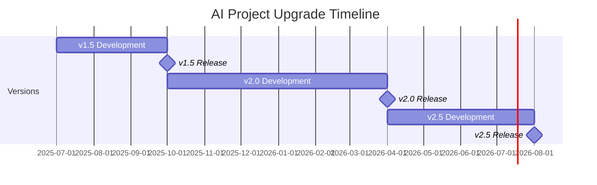

# Design Document: AI Project Upgrade Roadmap

## Overview

This design document outlines the approach for creating a comprehensive upgrade roadmap for an AI project. The roadmap will provide a structured plan for evolving the project across multiple versions, addressing current limitations while introducing new features and improvements. The document will be formatted in Markdown and will serve as a reference for project maintainers, developers, and stakeholders.

## Architecture

The upgrade roadmap will be structured as a hierarchical document with the following main sections:

1. **Versioning Strategy** - Defines how version numbers are assigned and incremented
2. **Current Limitations** - Identifies and categorizes existing issues and constraints
3. **Planned Improvements** - Details enhancements across multiple version releases
   - v1.5 (Minor version)
   - v2.0 (Major version)
   - v2.5+ (Future enhancements)

The document will be designed to be both human-readable and potentially machine-parsable, allowing for future automation of roadmap tracking and progress visualization.

## Components and Interfaces

### Versioning Strategy Component

This component will define:
- The versioning scheme (semantic vs. milestone-based)
- Rules for incrementing version numbers
- Handling of pre-releases and breaking changes
- Version numbering examples for clarity

### Current Limitations Component

This component will:
- Categorize limitations by type (performance, functionality, UX)
- Assign severity and impact ratings
- Map limitations to specific system components
- Provide context on how limitations affect users and system performance

### Planned Improvements Component

This component will be divided into three sub-components:

#### Minor Version Improvements (v1.5)
- Bug fixes with references to specific issues
- Performance optimizations with expected impact
- Code refactoring targets
- Minor feature enhancements

#### Major Version Improvements (v2.0)
- Architectural redesigns with rationale
- Major new features with descriptions
- Modularization strategy
- Breaking changes and migration guides

#### Future Enhancements (v2.5+)
- Optional integrations
- Research areas
- Long-term vision items
- Timeline estimates for future work

## Data Models

### Version Entity
```
Version {
  versionNumber: string
  releaseType: enum [MAJOR, MINOR, PATCH, PRE_RELEASE]
  estimatedReleaseDate: date (optional)
  breakingChanges: boolean
  features: Feature[]
  bugFixes: BugFix[]
  refactorings: Refactoring[]
}
```

### Limitation Entity
```
Limitation {
  id: string
  category: enum [PERFORMANCE, FUNCTIONALITY, UX, OTHER]
  severity: enum [LOW, MEDIUM, HIGH, CRITICAL]
  impact: enum [LOW, MEDIUM, HIGH]
  affectedComponents: string[]
  description: string
  potentialSolutions: string[]
}
```

### Improvement Entity
```
Improvement {
  id: string
  title: string
  description: string
  targetVersion: string
  type: enum [BUG_FIX, PERFORMANCE, FEATURE, REFACTORING, ARCHITECTURE]
  priority: enum [LOW, MEDIUM, HIGH]
  effort: enum [LOW, MEDIUM, HIGH]
  dependencies: string[] (IDs of other improvements)
  addressesLimitations: string[] (IDs of limitations)
}
```

## Error Handling

The roadmap document will include:

- Clear identification of potential risks for each planned improvement
- Contingency plans for high-risk changes
- Alternative approaches for features with technical uncertainty
- Fallback options for breaking changes

## Testing Strategy

For the roadmap document itself:

- Review by technical stakeholders to ensure technical feasibility
- Review by product stakeholders to ensure alignment with product vision
- Validation that all current limitations have corresponding improvements
- Verification that the versioning strategy is consistently applied
- Confirmation that all requirements are addressed in the design

## Implementation Considerations

### Document Format

The roadmap will be implemented as a Markdown document with:

- Clear hierarchical structure using headings (# for main sections, ## for subsections)
- Bullet points for lists of features, limitations, and improvements
- Tables for comparing versions or categorizing items
- Code blocks for technical examples where needed
- Links to relevant resources or issue trackers

### Integration with Project Management

The roadmap should be designed to:

- Be easily updatable as project priorities change
- Support linking to issue tracking systems
- Allow for progress tracking against planned improvements
- Facilitate communication between technical and non-technical stakeholders

### Visualization

Consider including:

- A timeline visualization using Mermaid diagrams
- Feature dependency graphs
- Version comparison tables

Example Mermaid timeline:

