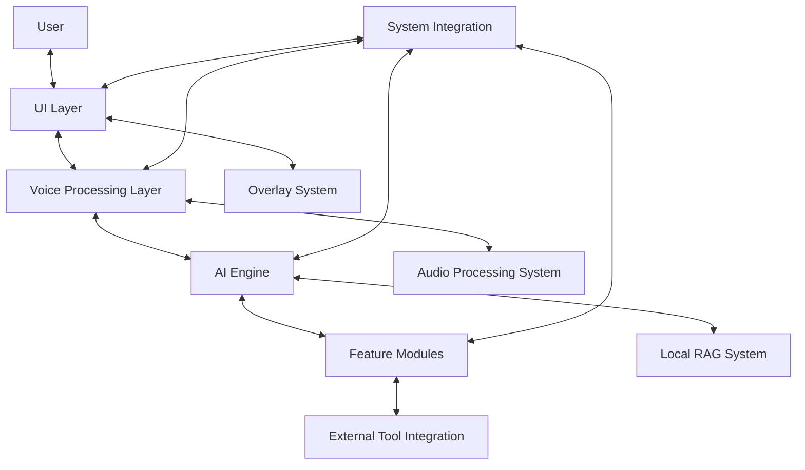

# Design Document

## Overview

The Jarvis Voice Assistant is a locally-run, voice-driven AI assistant inspired by J.A.R.V.I.S from Iron Man. It features a minimalist visual interface with floating overlays and operates primarily through voice commands. The system runs entirely on the local machine, prioritizing privacy and offline functionality while providing a cinematic, immersive user experience.

## Architecture

The application follows a modular architecture with the following key components:

1. **UI Layer**: Handles the visual interface, including the main dashboard, buttons, and overlay system.
2. **Voice Processing Layer**: Manages speech recognition and text-to-speech functionality.
3. **AI Engine**: Processes user queries and generates responses using local LLMs and RAG.
4. **Feature Modules**: Implements specialized assistant capabilities like translation, news, and language learning.
5. **System Integration**: Coordinates between components and manages resources.

### High-Level Architecture Diagram



## Components and Interfaces

### UI Layer

#### Main Dashboard
- **Glassmorphic Window**: Frameless, translucent window with blur effects
- **Action Buttons**: Six main buttons with neon glow effects
- **Voice Visualization**: Audio waveform animation with reactive effects

#### Overlay System
- **Base Overlay Class**: Translucent, floating windows with animations
- **Specialized Overlays**: Text, news, translation, and image overlays
- **Overlay Manager**: Handles creation, positioning, and lifecycle

### Voice Processing Layer

#### Speech Recognition
- **Whisper Model**: Local speech-to-text processing
- **Language Detection**: Automatic identification of Thai or English
- **Audio Capture**: Low-latency microphone input system

#### Text-to-Speech
- **F5-TTS Pipeline**: Local TTS with J.A.R.V.I.S voice clone
- **Audio Effects**: Reverb and metallic tone processing
- **Playback System**: Low-latency audio output

#### Voice Interaction Controller
- **State Machine**: Manages listening, processing, and response states
- **Event System**: Coordinates voice input and output timing
- **Error Handling**: Manages recognition failures and fallbacks

### AI Engine

#### Local LLM
- **Model**: Mistral 7B with 8-bit quantization
- **Prompt Templates**: Specialized formats for different query types
- **Response Parser**: Extracts structured data from model outputs

#### RAG System
- **Vector Database**: Local storage for embeddings
- **Document Processor**: Chunks and embeds knowledge sources
- **Query Engine**: Retrieves relevant context for user queries

#### Response Generator
- **Context Augmentation**: Enhances prompts with RAG results
- **Multilingual Support**: Handles Thai and English responses
- **Format Adapter**: Tailors responses for different output types

### Feature Modules

#### News System
- **Local Database**: Periodically updated news articles
- **Summarization Pipeline**: Creates concise news briefs
- **Category Filter**: Organizes news by topic

#### Translation Module
- **Bilingual Engine**: Thai-English translation
- **Explanation Generator**: Provides context for translations
- **Language Switcher**: Handles code-switching in conversations

#### Language Learning
- **Lesson Generator**: Creates vocabulary and phrase exercises
- **Pronunciation Analyzer**: Provides feedback on speaking
- **Adaptive Difficulty**: Adjusts based on user performance

#### ComfyUI Integration
- **API Client**: Communicates with local ComfyUI instance
- **Workflow Manager**: Handles image generation pipelines
- **Prompt Enhancer**: Improves image generation prompts

### System Integration

#### Application Controller
- **Event Bus**: Central communication system
- **State Manager**: Tracks application mode and status
- **Error Handler**: Manages recovery from failures

#### Configuration System
- **Settings Storage**: Persists user preferences
- **Theme Manager**: Handles visual customization
- **Resource Configuration**: Manages system resource allocation

#### Resource Manager
- **Memory Monitor**: Tracks GPU and RAM usage
- **Model Loader**: Dynamically loads/unloads AI models
- **Performance Optimizer**: Adjusts settings based on system load

## Data Models

### User Query
```
{
  "text": string,           // Raw text from speech recognition
  "language": string,       // Detected language code
  "intent": string,         // Classified user intent
  "parameters": Object,     // Extracted parameters from query
  "timestamp": DateTime     // When the query was received
}
```

### Assistant Response
```
{
  "text": string,           // Text to be spoken
  "language": string,       // Response language code
  "visualContent": {        // Optional visual content
    "type": string,         // "text", "image", "news", etc.
    "content": Object       // Type-specific content
  },
  "sources": Array,         // Reference sources if applicable
  "timestamp": DateTime     // When the response was generated
}
```

### Overlay Content
```
{
  "type": string,           // Overlay type
  "title": string,          // Optional title
  "content": Object,        // Type-specific content
  "duration": number,       // Display duration in seconds
  "position": {             // Screen position
    "x": number,
    "y": number
  },
  "size": {                 // Dimensions
    "width": number,
    "height": number
  }
}
```

### Configuration
```
{
  "ui": {
    "theme": string,        // UI theme name
    "opacity": number,      // Window opacity
    "scale": number         // UI scaling factor
  },
  "voice": {
    "inputDevice": string,  // Microphone device ID
    "outputDevice": string, // Speaker device ID
    "volume": number,       // Output volume
    "effects": {            // Voice effect settings
      "reverb": number,
      "metallic": number
    }
  },
  "ai": {
    "model": string,        // LLM model name
    "temperature": number,  // Response randomness
    "contextLength": number // Context window size
  },
  "system": {
    "gpuMemoryLimit": number, // Max GPU memory usage
    "startWithSystem": boolean // Auto-start with OS
  }
}
```

## Error Handling

### Voice Processing Errors
- **Recognition Failures**: Prompt user to repeat or rephrase
- **TTS Failures**: Fall back to simpler voice model or text display
- **Audio Device Errors**: Provide visual feedback and configuration options

### AI Engine Errors
- **Model Loading Failures**: Graceful degradation to smaller models
- **Response Generation Timeouts**: Implement early stopping with partial results
- **Context Overflow**: Automatically summarize and truncate context

### System Errors
- **Resource Limitations**: Adjust model parameters or disable features
- **External Tool Failures**: Provide meaningful error messages and alternatives
- **Unexpected Crashes**: Log diagnostics and implement auto-recovery

## Testing Strategy

### Unit Testing
- **Voice Processing**: Test recognition accuracy and TTS quality
- **AI Components**: Validate response quality and consistency
- **UI Elements**: Verify rendering and interaction behavior

### Integration Testing
- **End-to-End Flows**: Test complete user interaction scenarios
- **Performance Testing**: Measure response times and resource usage
- **Multilingual Testing**: Verify Thai and English functionality

### User Experience Testing
- **Voice Recognition Accuracy**: Test with different accents and environments
- **Response Quality**: Evaluate helpfulness and naturalness
- **UI Responsiveness**: Measure perceived performance and smoothness

## Implementation Considerations

### Performance Optimization
- Use 8-bit quantization for LLM to reduce memory footprint
- Implement dynamic model loading/unloading based on usage
- Optimize overlay rendering with hardware acceleration

### Privacy and Security
- Ensure all processing happens locally without external API calls
- Implement secure storage for any sensitive configuration data
- Provide clear user controls for data management

### Accessibility
- Support keyboard shortcuts for all voice-activated features
- Implement high-contrast mode for visual elements
- Provide text alternatives for all voice interactions

### Extensibility
- Design plugin architecture for future feature modules
- Create standardized interfaces for component communication
- Document extension points for customization