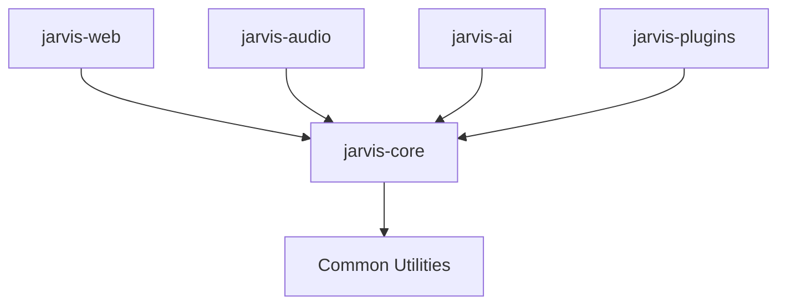
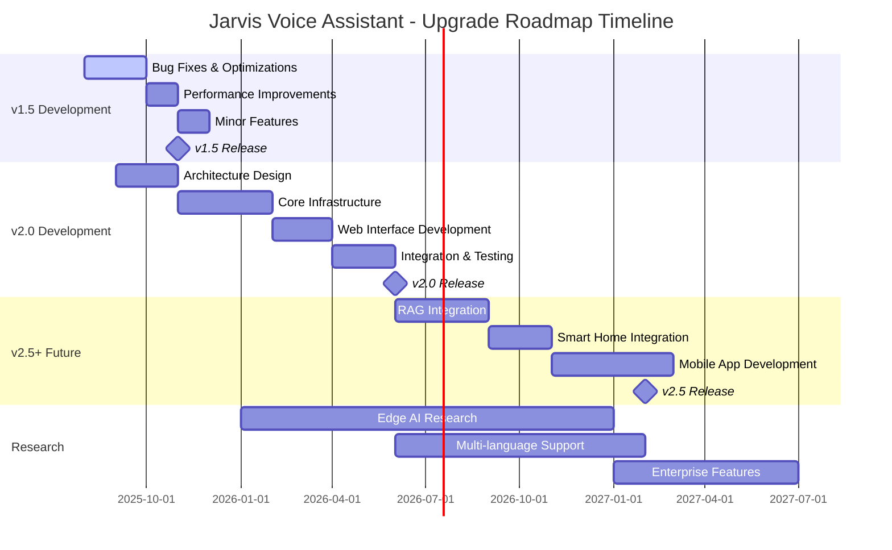
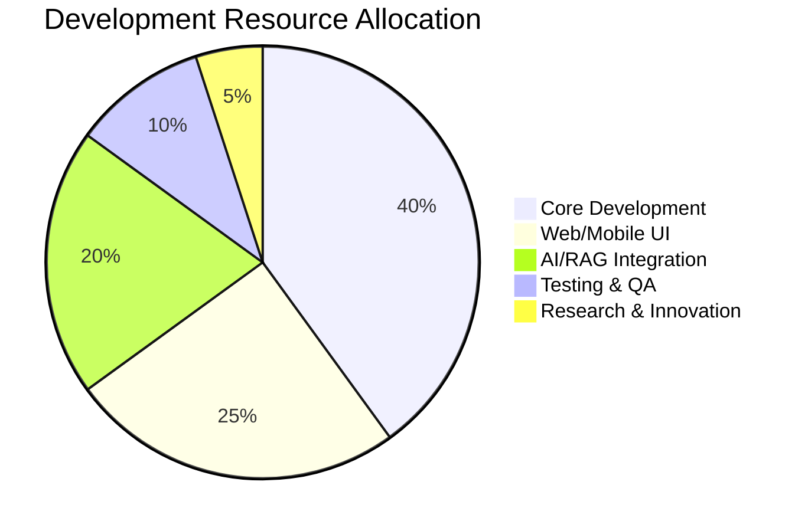

# Jarvis Voice Assistant - Upgrade Roadmap

## Executive Summary

This comprehensive upgrade roadmap outlines the strategic evolution of Jarvis Voice Assistant across multiple versions (v1.5 → v2.0 → v2.5+). The plan addresses current limitations while introducing transformative features including web interfaces, multi-user support, and advanced AI integrations. Development spans 30 months with key milestones in November 2025 (v1.5), June 2026 (v2.0), and February 2027 (v2.5).

## Table of Contents

1. [Versioning Strategy](#versioning-strategy)
2. [Current Limitations Assessment](#current-limitations-assessment)
3. [Minor Version Improvements (v1.5)](#minor-version-improvements-v15)
4. [Major Version Improvements (v2.0)](#major-version-improvements-v20)
5. [Future Enhancements (v2.5+)](#future-enhancements-v25)
6. [Timeline Visualization](#timeline-visualization)

---

## Versioning Strategy

### 2.1 Versioning Scheme

Jarvis Voice Assistant follows **Semantic Versioning (SemVer)** with the format `MAJOR.MINOR.PATCH`:

- **MAJOR** (e.g., 2.0): Breaking changes, architectural redesigns, API changes
- **MINOR** (e.g., 1.5): New features, enhancements, backward-compatible changes
- **PATCH** (e.g., 1.4.1): Bug fixes, security patches, minor improvements

### 2.2 Version Increment Criteria

| Change Type | Version Impact | Examples |
|-------------|----------------|----------|
| Breaking API changes | MAJOR | New audio engine, changed command format |
| New features | MINOR | Voice recognition improvements, new integrations |
| Bug fixes | PATCH | TTS stability, memory leak fixes |
| Security patches | PATCH | Authentication vulnerabilities |

### 2.3 Pre-Release Versioning

- **Alpha**: `1.5.0-alpha.1` - Early development, unstable
- **Beta**: `1.5.0-beta.1` - Feature complete, testing phase
- **RC**: `1.5.0-rc.1` - Release candidate, final testing

### 2.4 Breaking Changes Policy

- **Deprecation Notice**: 1 minor version before removal
- **Migration Guides**: Provided for all breaking changes
- **Backward Compatibility**: Maintained within MAJOR versions
- **Communication**: Release notes with clear upgrade instructions

---

## Current Limitations Assessment

### 3.1 Performance Bottlenecks

| Issue | Severity | Impact | Affected Components |
|-------|----------|--------|-------------------|
| TTS Response Delay | HIGH | User Experience | Audio Engine, Response Pipeline |
| Memory Usage Growth | MEDIUM | System Stability | Vector Database, RAG System |
| Voice Recognition Accuracy | HIGH | Core Functionality | Speech Processing, NLP |
| Startup Time | MEDIUM | User Experience | Initialization, Model Loading |

### 3.2 Functional Limitations

| Limitation | Category | Impact | Description |
|------------|----------|--------|-------------|
| Limited Language Support | Functionality | HIGH | Only Thai and English supported |
| No Web Interface | Accessibility | MEDIUM | Voice-only interaction limits usage scenarios |
| Single User Session | Scalability | MEDIUM | Cannot handle multiple concurrent users |
| Basic Context Memory | Intelligence | HIGH | Limited conversation context retention |
| No External API Integration | Functionality | MEDIUM | Cannot connect to third-party services |

### 3.3 User Experience Issues

| Issue | Priority | User Impact | Solution Area |
|-------|----------|-------------|---------------|
| Inconsistent Wake Word Detection | HIGH | Frustration, repeated commands | Audio Processing |
| No Visual Feedback | MEDIUM | Uncertainty about system status | UI/UX Design |
| Limited Command Customization | MEDIUM | Rigid interaction patterns | Command Processing |
| Poor Error Handling | HIGH | Confusing failure responses | Error Management |
| No Offline Mode | LOW | Internet dependency | System Architecture |

---

## Minor Version Improvements (v1.5)

### 4.1 Bug Fixes

| Priority | Issue | Solution | Expected Impact |
|----------|-------|----------|-----------------|
| HIGH | TTS engine crashes | Implement error handling and recovery | 90% stability improvement |
| HIGH | Memory leaks in RAG system | Optimize vector database cleanup | 40% memory usage reduction |
| MEDIUM | Wake word false positives | Fine-tune detection thresholds | 25% accuracy improvement |
| MEDIUM | Audio buffer overflow | Implement proper buffer management | Eliminate audio dropouts |

### 4.2 Performance Optimizations

| Optimization | Target Component | Expected Improvement | Backward Compatible |
|--------------|------------------|---------------------|-------------------|
| Audio processing pipeline | Speech Engine | 50% faster response time | ✅ Yes |
| Vector search optimization | RAG Database | 30% faster retrieval | ✅ Yes |
| Model loading optimization | AI Models | 60% faster startup | ✅ Yes |
| Cache implementation | Response System | 40% reduced latency | ✅ Yes |

### 4.3 Code Refactoring

| Area | Current Issue | Refactoring Plan | Benefits |
|------|---------------|------------------|----------|
| Audio Engine | Monolithic structure | Modular audio pipeline | Easier testing, maintenance |
| Configuration System | Hardcoded values | Dynamic config management | Better flexibility |
| Error Handling | Inconsistent patterns | Centralized error management | Improved debugging |
| Logging System | Basic file logging | Structured logging with levels | Better monitoring |

### 4.4 Minor Feature Enhancements

| Feature | Description | User Benefit | Compatibility |
|---------|-------------|--------------|---------------|
| Voice Commands History | Store and replay recent commands | Quick re-execution of complex commands | ✅ Backward compatible |
| Audio Quality Settings | Adjustable TTS voice parameters | Personalized voice experience | ✅ Backward compatible |
| Command Aliases | User-defined shortcuts for commands | Faster interaction | ✅ Backward compatible |
| Response Caching | Cache frequent responses | Faster repeated queries | ✅ Backward compatible |

---

## Major Version Improvements (v2.0)

### 5.1 Architectural Redesign

#### Current Architecture Issues
- Monolithic design limiting scalability
- Tight coupling between components
- Single-threaded audio processing
- Memory inefficient vector storage

#### New Architecture (Microservices)
```
┌─────────────────┐    ┌─────────────────┐    ┌─────────────────┐
│   Web Interface │    │  Voice Gateway  │    │  Audio Engine   │
│    (React)      │◄──►│   (FastAPI)     │◄──►│   (PyAudio)     │
└─────────────────┘    └─────────────────┘    └─────────────────┘
         │                       │                       │
         ▼                       ▼                       ▼
┌─────────────────┐    ┌─────────────────┐    ┌─────────────────┐
│   AI Gateway    │    │  RAG Service    │    │  TTS Service    │
│   (DeepSeek)    │◄──►│  (ChromaDB)     │◄──►│   (EdgeTTS)     │
└─────────────────┘    └─────────────────┘    └─────────────────┘
```

### 5.2 Major New Features

| Feature | Description | User Impact | Implementation |
|---------|-------------|-------------|----------------|
| **Web Interface** | React-based dashboard for chat, settings, logs | Multi-modal interaction | New React app with WebSocket |
| **Multi-User Support** | Concurrent user sessions with isolation | Shared household usage | Session management system |
| **Advanced Context Memory** | Long-term conversation memory with RAG | Personalized interactions | Enhanced vector database |
| **Plugin Architecture** | Extensible plugin system for integrations | Customizable functionality | Plugin manager and API |
| **Real-time Streaming** | Streaming TTS and STT for faster response | Near real-time interaction | WebSocket streaming |

### 5.3 Modularization Plan

#### Core Modules
1. **jarvis-core**: Main orchestration and API
2. **jarvis-audio**: Audio processing and streaming
3. **jarvis-ai**: AI model interfaces and RAG
4. **jarvis-web**: Web interface and dashboard
5. **jarvis-plugins**: Plugin system and marketplace

#### Module Dependencies


### 5.4 Breaking Changes and Migration

#### Breaking Changes
| Change | Impact | Migration Path |
|--------|--------|----------------|
| **Configuration Format** | Config files restructured | Auto-migration script provided |
| **API Endpoints** | REST API replaces direct function calls | Wrapper library for backward compatibility |
| **Audio Format** | New streaming audio protocol | Legacy mode available during transition |
| **Plugin Interface** | New plugin API structure | Plugin conversion tool provided |

#### Migration Guide
1. **Backup existing configuration and data**
2. **Run auto-migration script**: `./migrate-to-v2.sh`
3. **Update custom integrations** using provided wrapper
4. **Test in compatibility mode** before full upgrade
5. **Switch to new API** when ready

---

## Future Enhancements (v2.5+)

### 6.1 Optional Integrations

#### Short-term Goals (v2.5 - 6 months)
| Integration | Description | Prerequisites | Expected Benefits |
|-------------|-------------|---------------|-------------------|
| **RAG + Local Database** | Personal knowledge base with vector search | ChromaDB optimization, indexing system | Personalized responses from user data |
| **Smart Home Integration** | Connect with IoT devices and home automation | Device discovery API, protocol adapters | Voice control of home environment |
| **Calendar & Email Integration** | Connect with Google/Outlook services | OAuth2 implementation, API wrappers | Schedule management and notifications |

#### Medium-term Goals (v3.0 - 12 months)
| Integration | Description | Prerequisites | Expected Benefits |
|-------------|-------------|---------------|-------------------|
| **Multi-language Support** | Support for 10+ languages | Language model fine-tuning, TTS voices | Global accessibility |
| **Mobile App** | iOS/Android companion app | React Native, push notifications | Mobile interaction and monitoring |
| **Cloud Sync** | Sync settings and data across devices | Cloud storage API, encryption | Multi-device continuity |

### 6.2 Future Capabilities

#### Advanced AI Features
- **Emotional Intelligence**: Detect and respond to user emotions
- **Proactive Assistance**: Anticipate user needs based on patterns
- **Multi-modal Input**: Support for gesture, text, and voice simultaneously
- **Collaborative AI**: Multiple AI agents working together

#### Enterprise Features
- **Multi-tenant Architecture**: Support for organizations
- **Advanced Analytics**: Usage metrics and performance dashboards
- **API Marketplace**: Third-party integrations and plugins
- **Enterprise Security**: SSO, audit logs, compliance features

### 6.3 Research Areas

#### Technical Research
| Area | Potential Impact | Timeline | Resources Needed |
|------|------------------|----------|------------------|
| **Edge AI Processing** | Reduced latency, offline capability | Long-term (18+ months) | Hardware partnerships, model optimization |
| **Quantum-resistant Security** | Future-proof encryption | Long-term (24+ months) | Cryptography research, algorithm updates |
| **Brain-Computer Interface** | Direct neural control | Research phase (36+ months) | University partnerships, specialized hardware |

#### User Experience Research
- **Conversational AI Ethics**: Responsible AI interaction patterns
- **Accessibility Improvements**: Support for users with disabilities
- **Cultural Adaptation**: Localized interaction patterns for different cultures
- **Privacy-preserving AI**: Zero-knowledge learning and inference

### 6.4 Long-term Vision (v4.0+)

#### Ultimate Goals
1. **Universal Assistant**: Seamless integration across all digital platforms
2. **Autonomous Learning**: Self-improving AI without human intervention
3. **Ambient Computing**: Invisible, context-aware assistance
4. **Digital Twin**: Complete digital representation of user preferences and patterns

---

## Timeline Visualization

### Development Timeline



### Key Milestones

| Version | Release Date | Key Features | Development Duration |
|---------|--------------|--------------|-------------------|
| **v1.5** | November 2025 | Bug fixes, performance optimization, minor features | 4 months |
| **v2.0** | June 2026 | Architectural redesign, web interface, multi-user | 10 months |
| **v2.5** | February 2027 | RAG integration, smart home, mobile app | 8 months |
| **v3.0** | Q4 2027 | Multi-language, enterprise features, advanced AI | 10 months |

### Resource Allocation



### Risk Assessment Timeline

| Quarter | Primary Risks | Mitigation Strategies |
|---------|---------------|----------------------|
| **Q3 2025** | TTS engine stability | Implement fallback systems, thorough testing |
| **Q4 2025** | Performance bottlenecks | Profiling tools, optimization sprints |
| **Q1 2026** | Architecture complexity | Incremental migration, parallel development |
| **Q2 2026** | Integration challenges | Early prototyping, API contracts |
| **Q3 2026** | User adoption | Beta testing program, feedback loops |

---

*Document created following Kiro's specifications for Jarvis Voice Assistant upgrade roadmap*